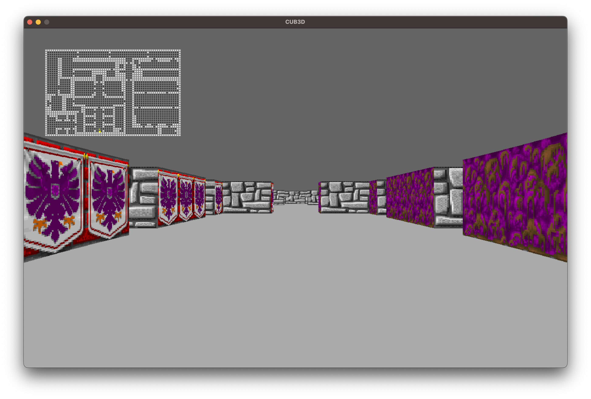
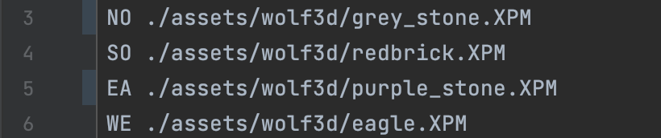
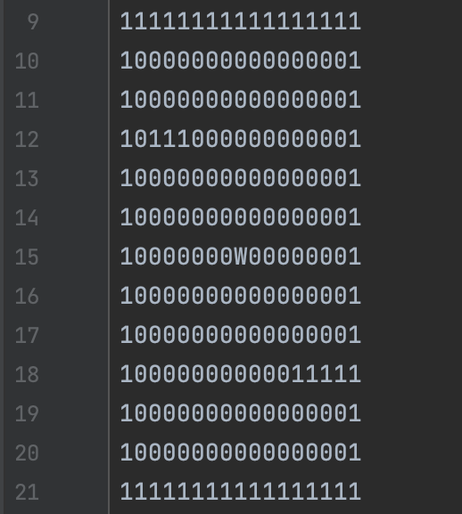

## 42_cub3D 🪖

* ### ℹ️&nbsp;&nbsp; general information
  * `Cub3D` is a project to **reproduce** the game dynamics of **Wolfenstein** 3D.
  * The project is done in groups of two people, in the `C language`.
  * Mathematical notions are approached in this project, such as `ray-casting`.
  * window management, reminiscent of the so_long project, these notions are recalled in cub3D.

* ### 👨‍🔧&nbsp;&nbsp; technical information

&nbsp;&nbsp;&nbsp;
[](Readme_img/cub3D.png)

   * 🎮&nbsp;&nbsp; **To play the game**
     
     * ```
       make re && ./Cub3D "mapname".cub
       ```
   * ⌨️&nbsp;&nbsp; **Commands**

     * `WASD` to move
     * `◀︎ or ▶︎` (Left/Right) directional keys to rotate camera.
     * `M` to display the map, &nbsp;&nbsp; ⚠️ &nbsp;&nbsp; **only in bonus**.
     * `ESC` or red button to quit.


   * 🗺️&nbsp;&nbsp; **Map**
     * The program must take as its **first argument** a
     **scene** with the extension `.cub`.
     * the `.cub` file must **contain** the `sprites` for the **walls**, the `colours` for the **floor and sky** and the `map`.


* The `sprites` have the **correct path to the images**, there are 4 different sprites `NO`, `SO`, `EA` and `WE`, each have a path.
     

&nbsp;&nbsp;&nbsp;&nbsp;&nbsp;&nbsp;
       [](Readme_img/trames.png)

* The `colours` are in **RGB** and display the right colour.
     
 
&nbsp;&nbsp;&nbsp;&nbsp;&nbsp;&nbsp;
       [](Readme_img/couleurs.png)
     

* The `map` is composed of **wall ("1")**, **ground ("0")** and **player**. The player has to look in the right 
      direction, either `N` (north), `S` (south), `W` (west), `E` (east).
       
&nbsp;&nbsp;&nbsp;&nbsp;&nbsp;&nbsp;
       [](Readme_img/carte.png)

## REFERENCES

* **Videos**
  * [Crazy Simple Ray casting E2](https://www.youtube.com/watch?v=Vihr-PVjWF4)
  * [Make Your Own Raycaster Part 1](https://www.youtube.com/watch?v=gYRrGTC7GtA) 
  
* **Documentation for reading**
  * [Lode's Computer Graphics Tutorial: Raycasting](https://lodev.org/cgtutor/raycasting.html)
  * [images in minilibx](https://github.com/keuhdall/images_example)
  * [Ray casting in French](http://forums.mediabox.fr/wiki/tutoriaux/flashplatform/affichage/3d/raycasting)
  * [Writing BMP image in pure c/c++ without other libraries](https://stackoverflow.com/questions/2654480/writing-bmp-image-in-pure-c-c-without-other-libraries)

ℹ️ Want more information for the **ray casting**: contact ️&nbsp;&nbsp; [amuhleth42](https://github.com/amuhleth42/42-Cub3D) !!!
